# Requisitos — Aneety Platform

## Produto

Aneety Platform deve oferecer operação white-label para produtos e serviços customizados. O fluxo central precisa acomodar consumidor, produtor, pedido, personalização, garantia de qualidade, retirada, entrega, evidências, mapas e rastreabilidade em tempo real. Lia é a primeira configuração de marca; os fluxos odontológicos do MVP são carga inicial de demonstração, seeds e massas de teste.

### Pedidos customizados

#### Fluxo de pedidos customizados

- Links: [fonte Mermaid](assets/diagrams/fluxo-pedidos-customizados.mmd) / [SVG](assets/diagrams/fluxo-pedidos-customizados.svg) / [JPEG](assets/diagrams/fluxo-pedidos-customizados.jpg)

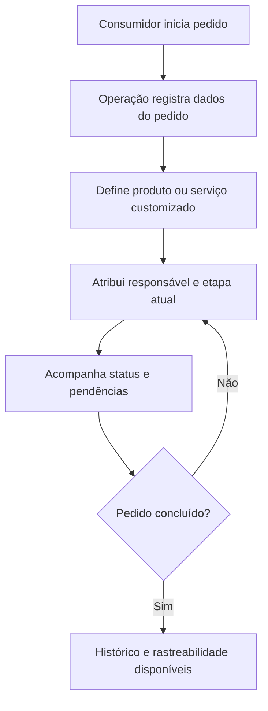

- Criar, listar, editar, cancelar e acompanhar pedidos.
- Registrar consumidor, contato, produto/serviço, especificação de personalização, endereço, observações, status e pagamento.
- Permitir responsáveis por etapa e histórico de atualização.
- Exibir rastreabilidade em tempo real do pedido, incluindo etapa atual, responsável, localizações relevantes e pendências de qualidade.

### Produção ou execução customizada

#### Fluxo de produção ou execução

- Links: [fonte Mermaid](assets/diagrams/fluxo-producao-execucao.mmd) / [SVG](assets/diagrams/fluxo-producao-execucao.svg) / [JPEG](assets/diagrams/fluxo-producao-execucao.jpg)

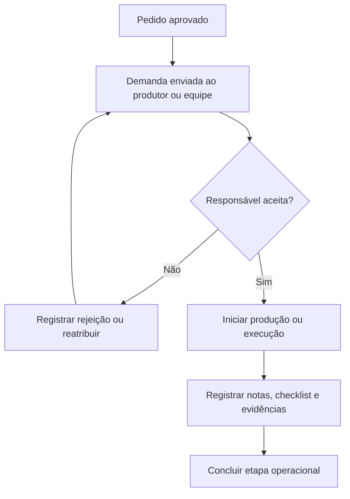

- Enviar demanda para produtor, operador ou equipe responsável.
- Permitir aceite, rejeição, cancelamento e andamento.
- Registrar início, conclusão, responsável, notas, checklist de qualidade e evidências.
- Separar execução feita por equipe própria, equipe associada ou operador terceiro.

### Garantia de qualidade

#### Fluxo de garantia de qualidade

- Links: [fonte Mermaid](assets/diagrams/fluxo-garantia-qualidade.mmd) / [SVG](assets/diagrams/fluxo-garantia-qualidade.svg) / [JPEG](assets/diagrams/fluxo-garantia-qualidade.jpg)

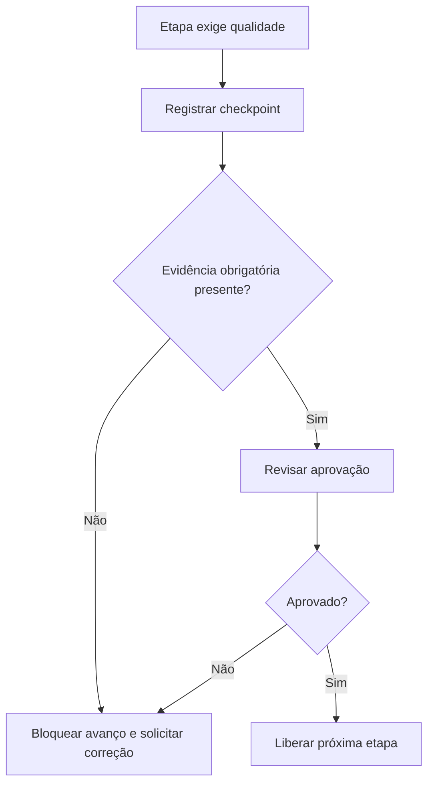

- Registrar checkpoints de qualidade antes, durante e depois da produção ou execução.
- Bloquear avanço quando evidência obrigatória, aprovação ou correção estiver pendente.
- Manter trilha de auditoria para alterações sensíveis de status, responsável, localização e aprovação.

### Retirada, entrega e mapas

#### Fluxo de retirada, entrega e mapas

- Links: [fonte Mermaid](assets/diagrams/fluxo-retirada-entrega-mapas.mmd) / [SVG](assets/diagrams/fluxo-retirada-entrega-mapas.svg) / [JPEG](assets/diagrams/fluxo-retirada-entrega-mapas.jpg)

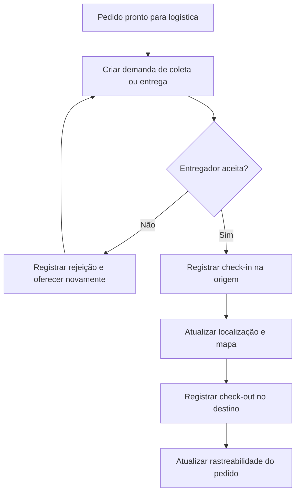

- Criar demandas de coleta e entrega.
- Permitir aceite/rejeição por entregador.
- Registrar check-in, check-out, origem, destino, responsável, localização operacional e evidências.
- Exibir mapas para acompanhamento de retirada, entrega, origem, destino e eventos relevantes.
- Manter rastreabilidade em tempo real para consumidor e operação, respeitando permissões por tenant e perfil.

### Anexos e evidências

#### Fluxo de anexos e evidências

- Links: [fonte Mermaid](assets/diagrams/fluxo-anexos-evidencias.mmd) / [SVG](assets/diagrams/fluxo-anexos-evidencias.svg) / [JPEG](assets/diagrams/fluxo-anexos-evidencias.jpg)

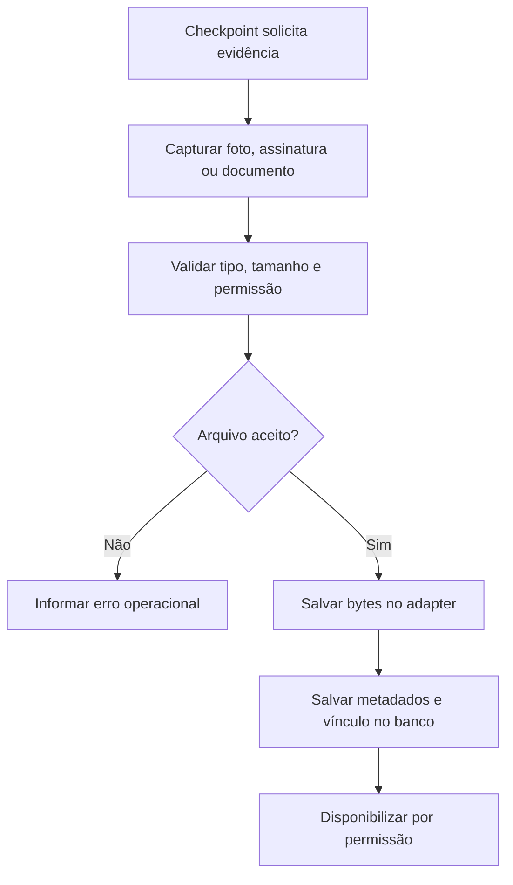

- Suportar fotos, assinaturas e documentos em checkpoints críticos.
- Armazenar metadados no banco com tenant, pedido, ator, origem, destino, data/hora, localização quando aplicável, tipo e permissão.
- Controlar tamanho, tipo, acesso e lifecycle.

### Pagamentos

#### Fluxo de pagamentos

- Links: [fonte Mermaid](assets/diagrams/fluxo-pagamentos.mmd) / [SVG](assets/diagrams/fluxo-pagamentos.svg) / [JPEG](assets/diagrams/fluxo-pagamentos.jpg)

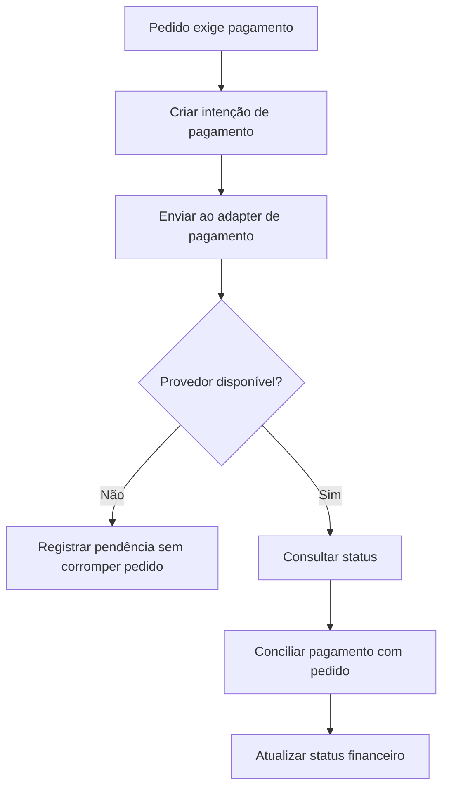

- Criar intenção de pagamento.
- Consultar status.
- Conciliar pagamento com pedido.
- Permitir operação sem corromper pedido quando provedor externo estiver indisponível.

### Marketplace operacional

#### Fluxo de marketplace operacional

- Links: [fonte Mermaid](assets/diagrams/fluxo-marketplace-operacional.mmd) / [SVG](assets/diagrams/fluxo-marketplace-operacional.svg) / [JPEG](assets/diagrams/fluxo-marketplace-operacional.jpg)

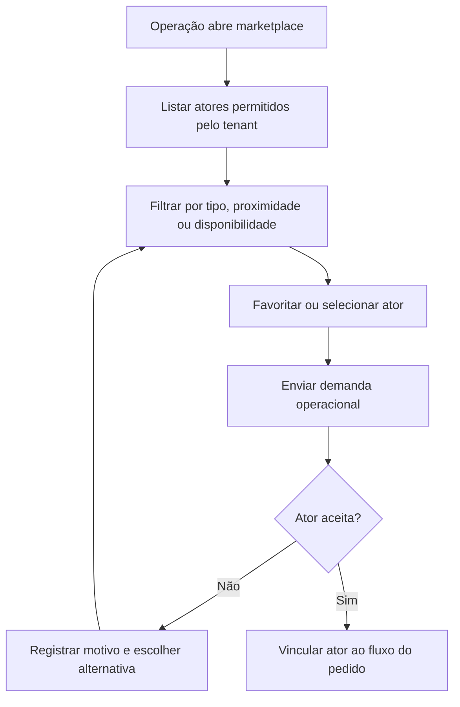

- Listar consumidores, produtores, operadores e entregadores conforme o tenant permitir.
- Filtrar por tipo e ordenar por nome, proximidade, favoritos, disponibilidade e pontuação.
- Favoritar/desfavoritar atores por tenant.
- Enviar demandas de produção, execução, coleta e entrega.
- Registrar motivos simples de rejeição.

### White-label por tenant

#### Fluxo white-label por tenant

- Links: [fonte Mermaid](assets/diagrams/fluxo-white-label-tenant.mmd) / [SVG](assets/diagrams/fluxo-white-label-tenant.svg) / [JPEG](assets/diagrams/fluxo-white-label-tenant.jpg)

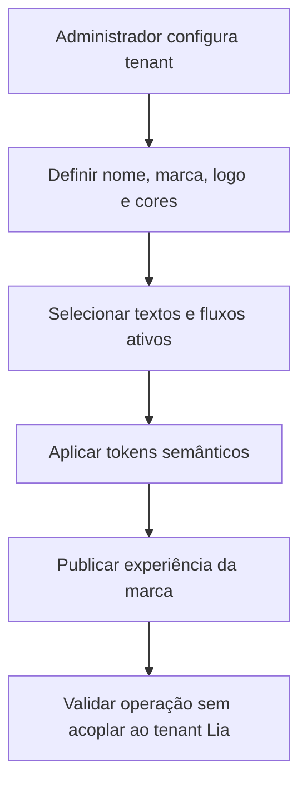

- Configurar nome, marca, logo, cores, textos principais, fluxos ativos e operação.
- Manter fluxos centrais genéricos para qualquer produto ou serviço customizado.
- Lia é a primeira configuração de marca.

### Carga inicial de demonstração e testes

#### Fluxo de carga inicial de demonstração e testes

- Links: [fonte Mermaid](assets/diagrams/fluxo-carga-demo-testes.mmd) / [SVG](assets/diagrams/fluxo-carga-demo-testes.svg) / [JPEG](assets/diagrams/fluxo-carga-demo-testes.jpg)

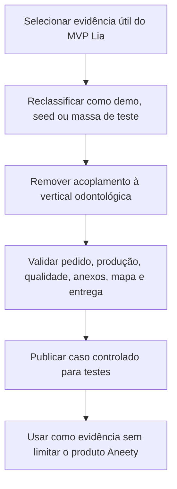

- Manter pedidos, moldes, próteses, retirada, entrega e evidências do MVP odontológico como seed/demo/test mass.
- Usar o fluxo odontológico para validar pedidos customizados, produção por terceiros, checklists de qualidade, anexos, mapas, rastreabilidade, coleta e entrega.
- Não tratar a vertical odontológica do Paraguai como limite do produto ou requisito exclusivo de domínio.

### Administração

#### Fluxo de administração

- Links: [fonte Mermaid](assets/diagrams/fluxo-administracao.mmd) / [SVG](assets/diagrams/fluxo-administracao.svg) / [JPEG](assets/diagrams/fluxo-administracao.jpg)

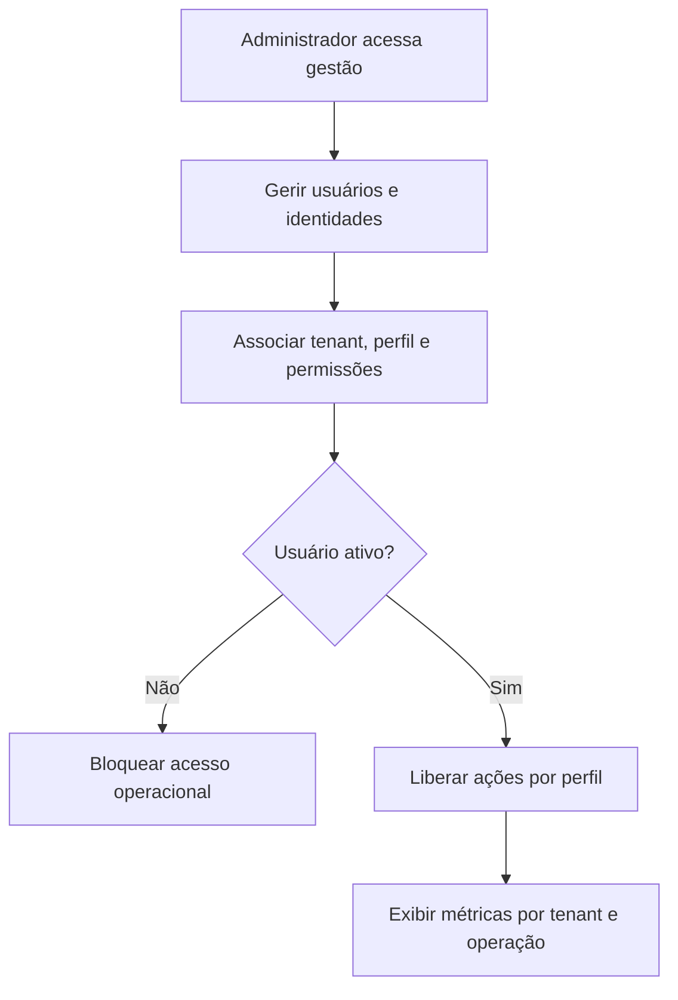

- Gerir usuários, identidades, perfis, permissões e status ativo/inativo.
- Associar usuário, tenant e perfil.
- Exibir métricas por tenant, operação, qualidade, produção, entrega e rastreabilidade.

### Integração opcional Gmail

#### Fluxo de integração opcional Gmail

- Links: [fonte Mermaid](assets/diagrams/fluxo-integracao-gmail.mmd) / [SVG](assets/diagrams/fluxo-integracao-gmail.svg) / [JPEG](assets/diagrams/fluxo-integracao-gmail.jpg)

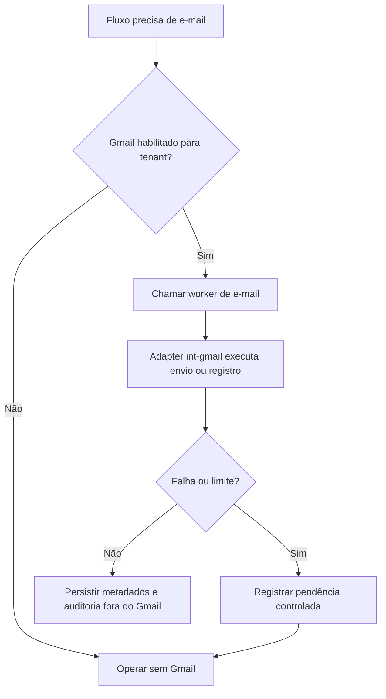

- A responsabilidade `comunicacao-email` deve tratar e-mail como função semântica separada de pedido, evidência, auditoria e autenticação.
- Gmail pode existir no MVP somente como adapter opcional `int-gmail`.
- O modo desligado deve ser aceito: a plataforma precisa criar, atualizar e acompanhar pedidos sem Gmail.
- Envio, recebimento ou registro auxiliar de e-mail deve passar por BFF/worker da responsabilidade, nunca por segredo no frontend.
- Metadados necessários para auditoria, vínculo com pedido, tentativas, erros e permissão devem ficar no banco da responsabilidade.
- Gmail não pode ser fonte única de pedido, evidência, auditoria, status operacional ou histórico obrigatório.
- Falha, limite ou indisponibilidade do Gmail deve preservar integridade de pedido, sessão, permissão, evidência, mapa, rastreabilidade e auditoria.

### Integração opcional Google SSO

#### Fluxo de integração opcional Google SSO

- Links: [fonte Mermaid](assets/diagrams/fluxo-integracao-google-sso.mmd) / [SVG](assets/diagrams/fluxo-integracao-google-sso.svg) / [JPEG](assets/diagrams/fluxo-integracao-google-sso.jpg)

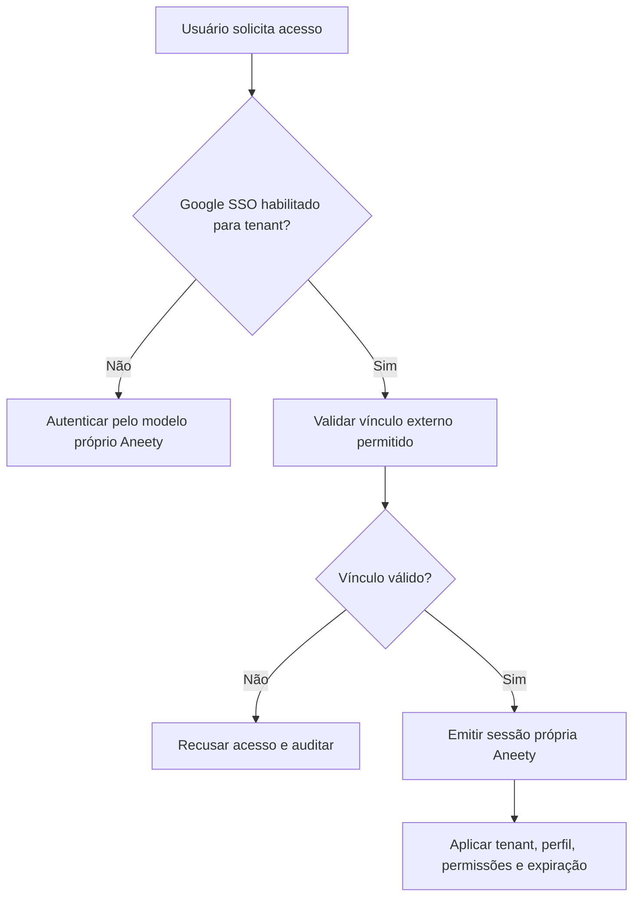

- A responsabilidade `identidade-federada` deve tratar vínculo SSO como função semântica separada da autenticação própria da plataforma.
- Google SSO pode existir no MVP somente como adapter opcional `int-google-sso`.
- O modo desligado deve ser aceito: a plataforma precisa autenticar usuários pelo modelo próprio Aneety sem Google SSO.
- Token externo serve apenas para verificar vínculo de identidade externa autorizado pelo tenant.
- Sessão final, expiração, revogação, tenant, perfil, permissões e auditoria devem permanecer no modelo próprio Aneety.
- Google SSO não pode emitir sessão final da plataforma, substituir permissões internas, substituir RLS ou virar requisito de login.
- Falha, recusa ou indisponibilidade do Google SSO deve preservar login próprio, administração de usuários, pedidos, evidências e auditoria.

## Técnico

- Org GitHub oficial: `https://github.com/Aneety`.
- Clone root local obrigatório: `/Users/mal/GitHub/Aneety/*`.
- Todo remoto `https://github.com/Aneety/<repo>` deve corresponder ao clone local `/Users/mal/GitHub/Aneety/<repo>`.
- Repo orquestrador de implementação: `Aneety/ai` (`https://github.com/Aneety/ai.git`, clone local `/Users/mal/GitHub/Aneety/ai`).
- Repo canônico de documentação: `Aneety/.github` (`https://github.com/Aneety/.github.git`, clone local `/Users/mal/GitHub/Aneety/.github`).
- Repo canônico de assets reutilizáveis: `Aneety/assets` (`https://github.com/Aneety/assets.git`, clone local `/Users/mal/GitHub/Aneety/assets`).
- Cada responsabilidade/derivação deve ter repositório próprio, clone local em `/Users/mal/GitHub/Aneety/<repo>` e link como submódulo no orquestrador.
- Cada projeto/repositório deve estar documentado em `Aneety/.github`, incluindo objetivo, owner, status, runtime, dados, contratos, critérios de aceite e links operacionais.
- Todo asset reutilizável do projeto deve estar versionado em SVG no repo `Aneety/assets`, incluindo logos, ícones, ilustrações, diagramas, marcas, pictogramas e elementos visuais compartilhados.
- Todos os frontends operacionais devem ser microfrontends Single SPA.
- Cada responsabilidade deve viver em `aneety-platform/apps/<responsabilidade>/...`.
- Cada microfrontend deve usar `mfe-<nome>` e chamar somente gateway/BFF, nunca banco direto.
- Gateway do MVP deve ser `worker-gateway` em Cloudflare/serverless/Hono.
- Cada BFF do MVP deve ser `worker-<nome>` em Cloudflare/serverless/Hono.
- Cada BFF deve possuir contrato HTTP, erros JSON padronizados, 401 para sessão ausente/inválida e 403 para permissão insuficiente.
- Banco do MVP deve ser Supabase/Postgres com schema por BFF.
- Banco futuro deve ser Postgres com banco de dados por BFF.
- Autenticação própria em banco: identidades, credenciais, sessões, tokens, expiração, revogação e rotação.
- Autorização por tenant, perfil e permissões, aplicada no gateway/BFF e reforçada por RLS.
- Isolamento cross-tenant obrigatório.
- `comunicacao-email` e `identidade-federada` devem ser responsabilidades separadas, com contratos, schemas e adapters independentes quando ativadas.
- Segredos de Gmail e Google SSO não podem aparecer em frontend, Git, bundle, log, screenshot, fixture pública ou documentação de usuário final.
- E2E de aceite deve cobrir modo desligado para Gmail e Google SSO.
- Experiência offline-first deve manter fila local para pedidos, checkpoints, anexos, mapas, rastreabilidade e pagamentos pendentes.
- E2E público somente em `aneety.com`.
- Guias de usuários, documentação de desenvolvedor, especificações, ADRs, arquitetura e catálogo de repositórios vivem em `Aneety/.github`; GitHub Pages, se existir, deve publicar ou apontar somente para essa documentação.
- Assets reutilizáveis devem ser consumidos de `Aneety/assets` ou referenciar sua fonte SVG canônica nesse repositório.
- Frontends não exigem variável pública de banco para login.
- Migrations e seeds ficam versionados no submódulo `db-<nome>` da responsabilidade.
- Cada microfrontend usa shadcn/ui e tokens semânticos.

### Requisitos não funcionais e aceite

- Seed E2E deve ser controlado, idempotente e sem segredos versionados.
- Backup/export Postgres deve estar documentado antes de dados reais relevantes.
- Smoke público deve cobrir, quando aplicável, microfrontend, gateway, BFF, banco, login, pedido, checkpoint, anexo, mapa, rastreabilidade e administração.
- Bloqueios operacionais devem ser registrados com causa objetiva, como DNS, secret ausente, policy falha, migration pendente, E2E sem credencial, mapa indisponível ou evento de rastreabilidade atrasado.
- Gmail e Google SSO devem ter modo desligado validado antes de qualquer ativação por tenant.
- Microfrontends com UI devem cobrir estados de carregando, vazio, erro e sucesso.

### Serviços externos por função semântica

- Hospedagem, gateway, BFF, banco, storage, CI, DNS/CDN, pagamentos, mensagens, e-mail, mapas, IA, observabilidade, filas e analytics devem ser requisitos por função, não por fornecedor.
- Qualquer serviço usado deve declarar dados tratados, segredos envolvidos, custo, alternativa de saída, contrato local e testes de degradação.
- Autenticação de usuário final pertence ao modelo de dados e ao gateway/BFF Aneety; provedor externo de identidade pode existir apenas como adapter opcional futuro, nunca como requisito de login.
- Gmail e Google SSO são adapters opcionais do MVP e devem ter plano de saída, teste de degradação e alternativa operacional sem fornecedor.
